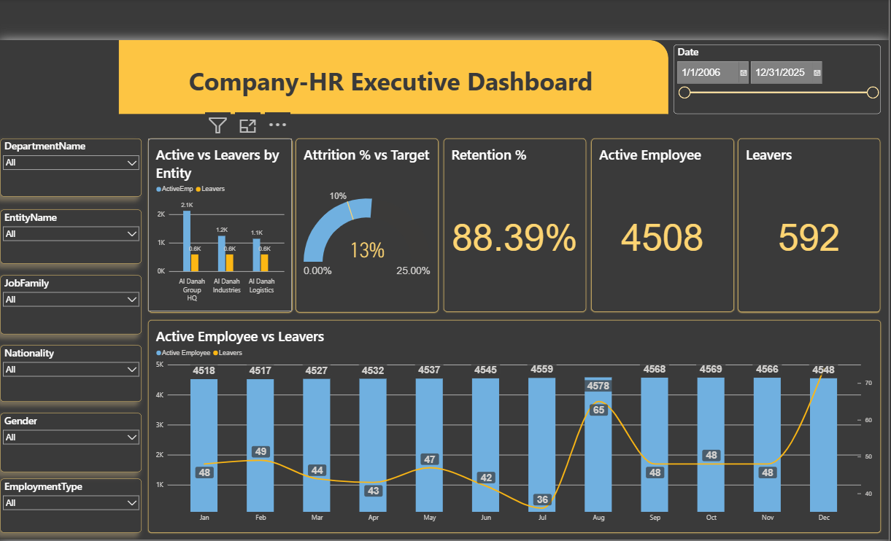
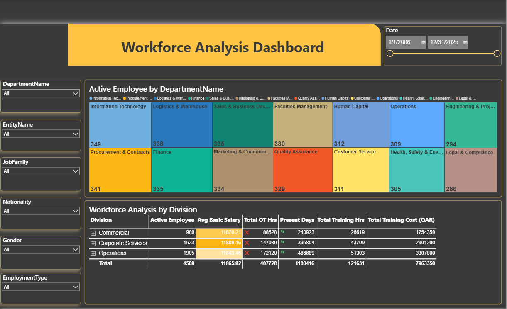
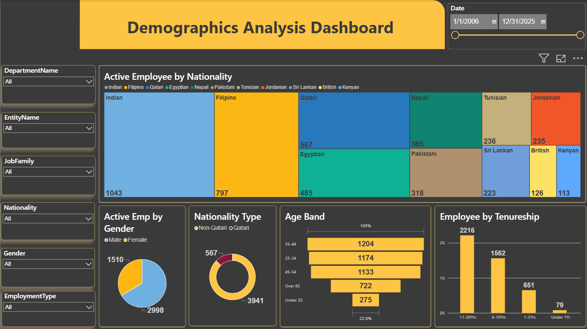
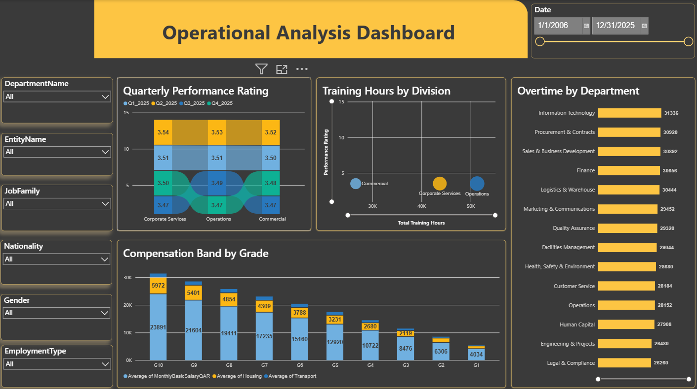
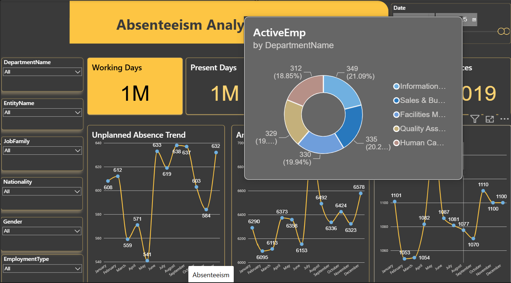
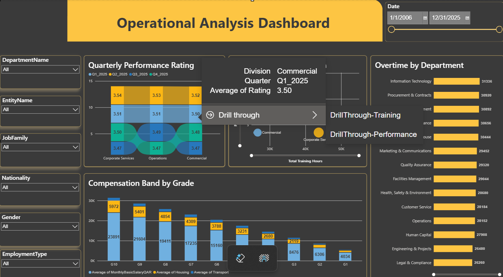

# HRBIDashboard

\# HR Analytics Dashboard — Power BI


A multi-page workforce analytics report built in Power BI Desktop on a GCC-context HR dataset. Covers headcount and attrition, workforce composition, demographics, compensation and performance, and absenteeism — with drill-through and tooltip pages wired throughout.


\*\*Author:\*\* Michelle R. Palatino — HR Systems \& Analytics

\*\*Tools:\*\* Power BI Desktop · DAX · Power Query · star-schema modelling


> \*\*Data statement:\*\* All data in this report is synthetic, generated for demonstration purposes. It does not represent any real organization, employee, or employment record. No employer data, files, or assets are used anywhere in this repository.


\---


\## Why this exists


Most HR teams can produce a headcount export. Fewer can turn that export into an attrition trend a director will act on. The gap is rarely the tool — it is the data model and the measure definitions. This report is a worked demonstration of both: a properly separated star schema, a dedicated date table driving all time intelligence, and attrition measures built to a recognized standard rather than improvised.


\---


\## Report pages


| Page | Purpose |

|---|---|

| \*\*Executive\*\* | Headline KPI view — monthly headcount, leavers, attrition % and retention % against min/max target bands |

| \*\*Workforce Analysis\*\* | Composition by division, department, job family and entity; salary, overtime, training hours and cost |

| \*\*Demographics Analysis\*\* | Age bands, tenure bands, gender, nationality and nationality type (Qatari / Non-Qatari) split |

| \*\*Operational Analysis\*\* | Compensation band by grade, housing and transport allowances, quarterly performance ratings, training spend |

| \*\*Absenteeism\*\* | Unplanned absences, sick leave, annual leave and days present against working days |


Supporting pages: two drill-through pages (Training, Performance) and four report-page tooltips (Sick Leave, Absenteeism, Annual Leave, Gender).


\---


\## Data model


Star schema — ten tables plus a dedicated measure table.


```

&#x20;                     DateTable

&#x20;                         │

&#x20;  Departments ──┐        │        ┌── Jobs

&#x20;  Locations ────┼── FinalMasterData ──┼── SalaryGrades

&#x20;                └────────┬───────┘

&#x20;                         │

&#x20;     ┌───────────┬───────┴────┬────────────┐

&#x20; Separations  Monthly\_    Performance   Training

&#x20;              Attendance                 Record

```


| Table | Grain |

|---|---|

| `FinalMasterData` | One row per employee — the dimension all facts hang from |

| `Separations` | One row per exit event |

| `Monthly\_Attendance` | One row per employee per month |

| `Performance` | One row per employee per review quarter |

| `TrainingRecord` | One row per training event |

| `Departments`, `Jobs`, `Locations`, `SalaryGrades` | Lookup dimensions |

| `DateTable` | Marked as the date table; drives all time intelligence |

| `\_Measures` | Measures-only table, no data — keeps the field list clean |


\*\*Design note:\*\* separations are held in their own fact table rather than as a flag on the employee master. Attrition is an event stream and headcount is a point-in-time snapshot; collapsing them into one table is the most common cause of double-counted turnover in HR dashboards.


\---


\## Measures


Held in the `\_Measures` table:


\- `ActiveEmp` — ActiveEmp = CALCULATE(COUNTROWS(FinalMasterData), FinalMasterData\[Status] = "Active")

\- `Monthly Headcount` — Monthly Headcount = DISTINCTCOUNT(Monthly\_Attendance\[EmployeeID])

\- `Leavers` — Leavers = COUNTROWS(Separations)

\- `Attrition %` — Attrition % = DIVIDE(\[Leavers], \[Avg Headcount])

\- `Retention %` — Retention % = DIVIDE(\[ActiveEmp], \[ActiveEmp] + \[Leavers])

\- `Attrition MaxTarget` — 0.25

\- `Attrition MinTarget` — 0.10


Attrition follows the standard SHRM formula: separations divided by \*average\* headcount for the period, where average headcount is opening plus closing divided by two. Opening or closing headcount alone is not used as the denominator — a workforce that grows or shrinks materially during the period will distort the rate either way.


\### Definitional rules applied


\- Voluntary and involuntary separations both count as leavers.

\- Internal transfers, promotions, and employees on extended leave are excluded — they remain on payroll, and including them inflates the rate.

\- Monthly rates are reported as monthly. They are not multiplied by twelve to annualise; the annual figure is calculated across the full twelve-month window.


\---


\## Interaction design


\- \*\*Drill-through\*\* from the Workforce and Operational pages into Training and Performance detail, filtered to the selected context.

\- \*\*Report-page tooltips\*\* for absence, sick leave, annual leave and gender — hovering a bar surfaces a small contextual chart rather than a raw value.

\- Cross-filtering across all slicers: date, entity, division, department, job family, employment type, gender and nationality.


\---


\## Running it


1\. Clone the repository and open `HRBI_Repo1.pbix` in Power BI Desktop.

2\. The synthetic dataset is embedded — the file opens and renders without any data source configuration.

3\. To point it at your own data, source tables must match the schema above on column names and types.


\---


\## Methodology references


\- \*\*SHRM turnover methodology\*\* — turnover rate as separations ÷ average headcount × 100, with average headcount = (beginning + ending headcount) ÷ 2. The most widely adopted version of the formula in HR reporting.

\- \*\*US Bureau of Labor Statistics, JOLTS\*\* — separations definitions and published industry benchmark rates.

\- \*\*CIPD\*\* — voluntary versus involuntary turnover framing and retention interpretation.

\- \*\*Microsoft Power BI documentation\*\* — star schema guidance and date table requirements for time intelligence.


Verify current URLs for each source before citing in a client or employer deliverable; SHRM and CIPD reorganise their resource libraries periodically.


\---


\## Roadmap


\- \[ ] Row-level security example for department-scoped access

\- \[ ] Nationalisation ratio tracking page

\- \[ ] Published walkthrough of the tenure-banding pattern


## Screenshots

### Executive


### Workforce Analysis


### Demographics Analysis


### Operations


### Absenteeism


### Operations with Drill Through


